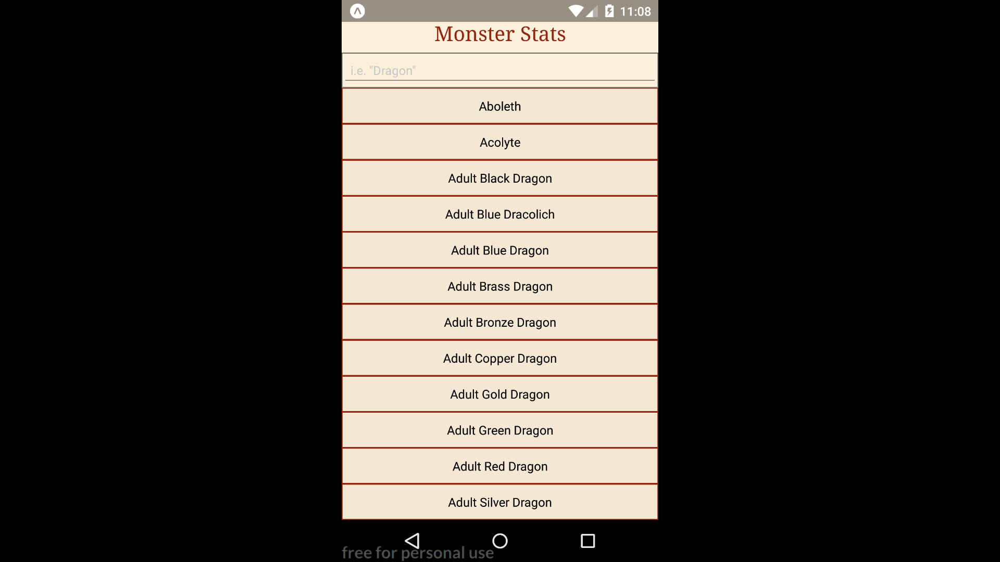
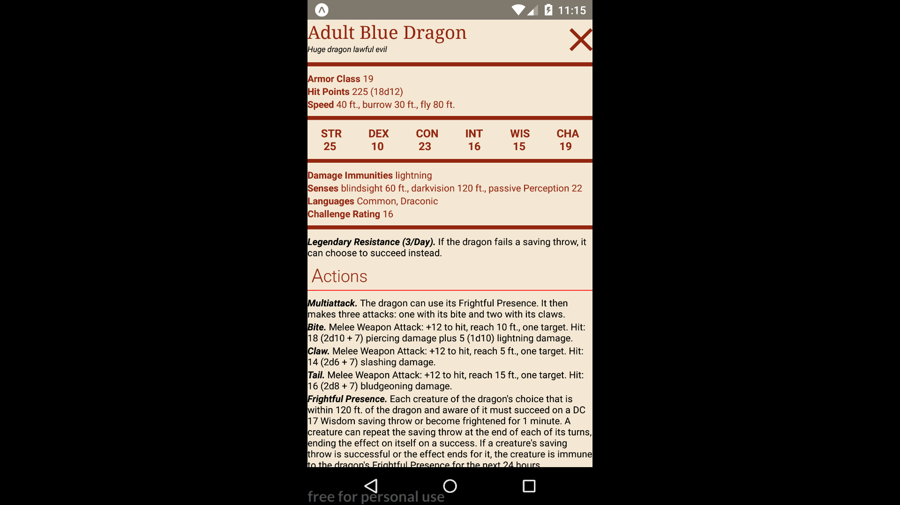

# Monster Stats
Monster Stats is a mobile app built with React Native that helps Dungeons & Dragons fans look up the stats of their favourite monsters. It comes with search functionality and 325 monsters to look up.

## Getting started
run the following in your terminal
```
<!-- make sure you have npm installed -->
git clone git@github.com:BrooklinJazz/monster-stats.git
cd <project name>
npm install
npm start
```
then open using your prefered android or ios simulator.

## Tech
1. React-Native
2. Javascript
3. Axios
4. D&D Api http://www.dnd5eapi.co/
5. fraction.js https://www.npmjs.com/package/fraction.js
6. react-native-loading-spinner-overlay https://www.npmjs.com/package/react-native-loading-spinner-overlay

## Examples:
### Home Page

### Monster Stat Block
